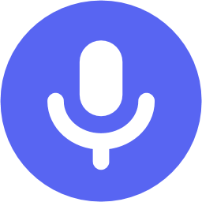
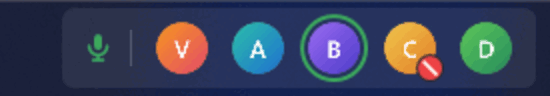
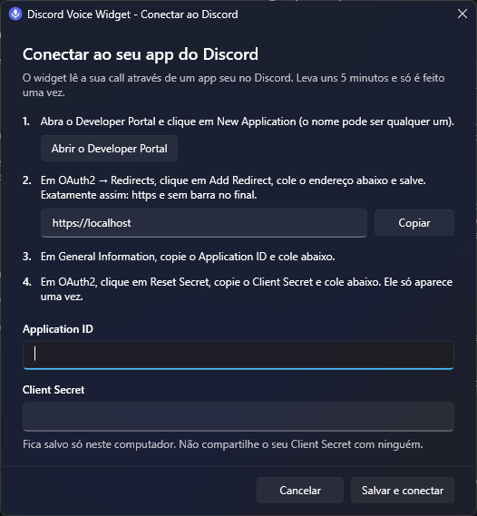
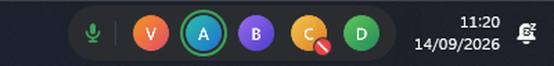
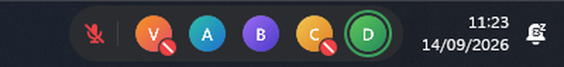
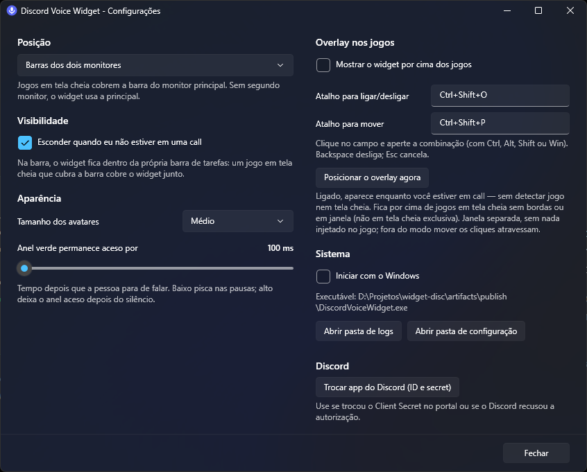

<div align="center">



# Discord Voice Widget

**Veja quem está na sua call do Discord e quem está falando — direto na barra de tarefas do Windows 11.**

[](https://github.com/Lintzz/widget-disc/releases/latest)


[](LICENSE)



<sub>Pessoas e avatares fictícios, gravados com o modo demonstração (<code>--demo</code>).</sub>

[**Baixar**](https://github.com/Lintzz/widget-disc/releases/latest) · [Configuração](#configuração-inicial) · [Funcionalidades](#funcionalidades) · [Desenvolvimento](#desenvolvimento)

</div>

---

## Destaques

- **Avatares da call na barra de tarefas**, embutidos na própria barra, ao lado do relógio.
- **Anel verde em quem está falando**, com um pequeno atraso ajustável para não piscar nas pausas da fala.
- **Seu microfone em um relance**: ícone verde quando aberto, vermelho quando mutado ou ensurdecido.
- **Quem está mutado** ganha um selo vermelho no avatar.
- **Um ou dois monitores**: na barra secundária (que continua visível durante jogos em tela cheia), na principal ou nas duas.
- **Overlay sobre os jogos** opcional, com atalhos globais e cliques que atravessam a janela.
- **Ícone na bandeja** com a cor do estado atual e acesso rápido às configurações.
- **Leve**: cerca de 25 MB de memória, nada rodando fora de call e nenhum uso de GPU.

## Requisitos

- Windows 11
- **Discord de desktop** aberto (a versão do navegador não funciona)
- [.NET 10 Desktop Runtime](https://dotnet.microsoft.com/download/dotnet/10.0) — o instalador oferece instalar se faltar

## Instalação

1. Baixe o `DiscordVoiceWidget-Setup-<versão>.exe` na [página de releases](https://github.com/Lintzz/widget-disc/releases/latest).
2. Execute o instalador. Ele instala só para o seu usuário, sem pedir administrador.

> [!NOTE]
> O instalador não é assinado digitalmente, então o Windows pode mostrar o aviso do SmartScreen.
> Clique em **Mais informações → Executar assim mesmo**.

O instalador cria o atalho no Menu Iniciar, oferece iniciar com o Windows e registra o
desinstalador em **Configurações → Aplicativos**. Ao desinstalar, ele pergunta se você
quer apagar também as configurações e as credenciais.

## Configuração inicial

O widget lê a sua call pelo servidor RPC local do Discord, que exige um **app seu** no
Discord Developer Portal. É feito uma única vez e leva uns 5 minutos — a própria janela
de primeira execução guia o passo a passo:

<div align="center">

</div>

1. Abra o [Developer Portal](https://discord.com/developers/applications) e clique em **New Application**.
2. Em **OAuth2 → Redirects**, adicione exatamente `https://localhost` (com `https` e **sem barra no final**) e salve.
3. Em **General Information**, copie o **Application ID** e cole na janela.
4. Em **OAuth2**, clique em **Reset Secret**, copie o **Client Secret** e cole na janela.
5. Clique em **Salvar e conectar** e, no pedido que abre dentro do Discord, em **Autorizar**.

Pronto: ao entrar em uma call, o widget aparece. Para trocar de app ou de secret depois,
use **Configurações → Trocar app do Discord**.

> [!IMPORTANT]
> Não compartilhe o seu Client Secret. Cada pessoa que for usar o widget deve criar o próprio app —
> o Discord só libera os eventos de voz para o dono do app e para testers convidados.

## Funcionalidades

### Na barra de tarefas

| Estado | Como aparece |
|---|---|
| Alguém falando, seu microfone aberto |  |
| Seu microfone mutado, participantes mutados |  |

Passe o mouse sobre um avatar para ver o nome da pessoa. Clique com o botão direito no
widget para abrir as configurações.

Fora de call o widget se esconde (configurável). O ícone da bandeja fica sempre presente
e muda de cor conforme o estado:

| Cor do ícone | Estado |
|---|---|
| Cinza | Discord fechado ou indisponível |
| Azul acinzentado | Conectando ou aguardando autorização |
| Azul | Conectado, fora de call |
| Verde | Em call |
| Vermelho com traço | Em call com o microfone mutado ou ensurdecido |

> [!TIP]
> No Windows 11, ícones novos vão para o menu de ocultos (`^`). Arraste o ícone para a barra se
> quiser o indicador sempre à vista.

### Configurações

Abra com clique duplo no ícone da bandeja. As mudanças valem na hora, sem botão Salvar.

<div align="center">

</div>

| Opção | Padrão |
|---|---|
| Barra usada: secundária (ao lado do relógio), principal (ao lado da bandeja) ou as duas | Secundária |
| Esconder quando não estiver em call | Sim |
| Tamanho dos avatares: pequeno, médio ou grande | Médio |
| Tempo que o anel verde fica aceso depois da fala | 350 ms |
| Overlay sobre os jogos | Desligado |
| Atalho para ligar/desligar o overlay | `Ctrl+Shift+O` |
| Atalho para mover o overlay | `Ctrl+Shift+P` |
| Iniciar com o Windows | Não (o instalador oferece) |

> [!TIP]
> Por que a barra secundária? Um jogo em tela cheia no monitor principal cobre a barra dele,
> mas a barra do segundo monitor continua visível. Sem segundo monitor, o widget usa a principal.

### Overlay nos jogos

Uma cópia do widget flutuando sobre o jogo, somando-se aos widgets da barra.

| Ação | Como |
|---|---|
| Ligar / desligar | `Ctrl+Shift+O`, menu da bandeja ou Configurações |
| Posicionar | `Ctrl+Shift+P`, arraste para o lugar e `Ctrl+Shift+P` de novo para fixar |
| Trocar os atalhos | Configurações → clique no campo e aperte a combinação (Backspace desliga) |

- Funciona com jogos em **tela cheia sem bordas** ou em janela. Em tela cheia *exclusiva*, o
  Windows não deixa nenhuma janela de outro programa aparecer por cima.
- É uma janela separada: nada é injetado no jogo nem no Discord.
- Fora do modo mover, todos os cliques atravessam a janela e vão para o jogo.

## Privacidade e segurança

- Tudo roda **localmente**: o widget conversa com o Discord pelo pipe local e só acessa a
  internet para baixar avatares do CDN do Discord e para obter/renovar o token de autorização.
- Nenhum dado é enviado para servidores de terceiros.
- O token fica em `%APPDATA%\DiscordVoiceWidget\token.dat`, criptografado com DPAPI (só o seu
  usuário do Windows, nesta máquina, consegue ler).
- As credenciais do app ficam em `%APPDATA%\DiscordVoiceWidget\config.json`, fora do repositório.
- Logs em `%LOCALAPPDATA%\DiscordVoiceWidget\logs\`, apagados depois de 7 dias.

## Solução de problemas

| Sintoma | Causa provável |
|---|---|
| Widget mostra "Discord fechado" | O Discord de desktop não está aberto, ou está rodando como administrador e o widget não |
| A janela de credenciais reabre dizendo que o Discord recusou | Client Secret errado ou redirect `https://localhost` não salvo no portal (confira: `https`, sem barra no final) |
| Nenhum pedido de autorização aparece no Discord | Confira se o Application ID é do app que você criou; use **Configurações → Trocar app do Discord** |
| O widget não aparece durante a call | Verifique a opção de barra nas Configurações; com um jogo em tela cheia, a barra daquele monitor fica coberta |
| O overlay não aparece no jogo | O jogo está em tela cheia exclusiva; mude para tela cheia sem bordas |

Os logs (botão **Abrir pasta de logs** nas Configurações) mostram o motivo exato da maioria dos erros.

## Desenvolvimento

Requisitos: [.NET SDK 10](https://dotnet.microsoft.com/download/dotnet/10.0). Para gerar o
instalador, também o [Inno Setup 6](https://jrsoftware.org/isinfo.php).

```bash
# rodar o widget
dotnet run --project src/DiscordVoiceWidget.App

# modo demonstração: call fictícia, sem Discord e sem gravar configurações
dotnet run --project src/DiscordVoiceWidget.App -- --demo
dotnet run --project src/DiscordVoiceWidget.App -- --demo-muted

# harness de console da biblioteca de voz (útil para isolar problemas do RPC)
dotnet run --project tools/RpcSpike

# publicar e gerar o instalador em artifacts/
powershell -ExecutionPolicy Bypass -File installer\build.ps1
```

A versão vem do `<Version>` em [`DiscordVoiceWidget.App.csproj`](src/DiscordVoiceWidget.App/DiscordVoiceWidget.App.csproj).

### Estrutura

```
src/
  DiscordVoiceWidget.Rpc/    biblioteca de voz: pipe do Discord, OAuth, reconexão, debounce da fala
  DiscordVoiceWidget.App/    aplicação WPF: widget na barra, overlay, bandeja, configurações
tools/
  RpcSpike/                  harness de console sobre a biblioteca
  IconGen/                   gera o ícone em assets/
installer/                   script do Inno Setup e build.ps1
docs/                        arquitetura e imagens do README
```

Detalhes de funcionamento, decisões de desempenho e armadilhas da integração com a barra de
tarefas e com o RPC do Discord estão em [**docs/ARQUITETURA.md**](docs/ARQUITETURA.md).

## Créditos

- A técnica de embutir o widget na barra de tarefas e o posicionamento ao lado do relógio foram
  inspirados no [FluentFlyout](https://github.com/unchihugo/FluentFlyout), de unchihugo (GPL-3.0).

## Licença

Distribuído sob a [GNU General Public License v3.0](LICENSE).

---

<sub>Projeto independente, sem afiliação, patrocínio ou endosso da Discord Inc. "Discord" é marca registrada da Discord Inc.</sub>
